# 快速开始

本文档将指导您完成 DataAgent 的安装、配置和首次运行。

## 📋 环境要求

- **JDK**: 17 或更高版本
- **MySQL**: 5.7 或更高版本
- **Node.js**: 16 或更高版本
- **Docker**: (可选) 用于Python代码执行
- **向量数据库**: (可选) 默认使用内存向量库

## ✅ 我使用的环境配置
- **JDK**: 17
- **MySQL**: 9.6.0
- **Node.js**: 24.13.0
- **Npm**: 11.6.2
- **Docker**: 28.5.2,用于Python代码执行
- **向量数据库**:内存向量库

## 🗄️ 1. 业务数据库准备

可以在项目仓库获取测试表和数据：

文件在：`data-agent-management/src/main/resources/sql`，里面有4个文件：
- `schema.sql` - 功能相关的表结构，这个表必须执行
- `data.sql` - 功能相关的数据
- `product_schema.sql` - 模拟数据表结构
- `product_data.sql` - 模拟数据

将表和数据导入到你的MySQL数据库中。

```bash
# 示例：使用 MySQL 命令行导入
mysql -u root -p your_database < data-agent-management/src/main/resources/sql/schema.sql
mysql -u root -p your_database < data-agent-management/src/main/resources/sql/data.sql
mysql -u root -p your_database < data-agent-management/src/main/resources/sql/product_schema.sql
mysql -u root -p your_database < data-agent-management/src/main/resources/sql/product_data.sql
```

我的执行命令如下：
```bash
cat data-agent-management/src/main/resources/sql/schema.sql | docker exec -i mysql mysql -u root -p123456 --default-character-set=utf8mb4 cache_cloud
cat data-agent-management/src/main/resources/sql/data.sql | docker exec -i mysql mysql -u root -p123456 --default-character-set=utf8mb4 cache_cloud
cat data-agent-management/src/main/resources/sql/product_schema.sql | docker exec -i mysql mysql -u root -p123456 --default-character-set=utf8mb4 cache_cloud
cat data-agent-management/src/main/resources/sql/product_data.sql | docker exec -i mysql mysql -u root -p123456 --default-character-set=utf8mb4 cache_cloud
```

## ⚙️ 2. 配置

### 2.1 配置management数据库

在`data-agent-management/src/main/resources/application.yml`中配置你的MySQL数据库连接信息。

> 初始化行为说明：默认开启自动创建表并插入示例数据（`spring.sql.init.mode: always`）。生产环境建议关闭（改为never），避免示例数据回填覆盖你的业务数据。

```yaml
spring:
  datasource:    # 请替换为你的数据库连接信息
    url: jdbc:mysql://127.0.0.1:3306/saa_data_agent?useUnicode=true&characterEncoding=utf-8&zeroDateTimeBehavior=convertToNull&transformedBitIsBoolean=true&allowMultiQueries=true&allowPublicKeyRetrieval=true&useSSL=false&serverTimezone=Asia/Shanghai
    username: ${MYSQL_USERNAME:root}
    password: ${MYSQL_PASSWORD:root}
    driver-class-name: com.mysql.cj.jdbc.Driver
    type: com.alibaba.druid.pool.DruidDataSource
```

### 2.2 数据初始化配置

配置前缀: `spring.sql.init`

| 配置项 | 说明 | 默认值 | 备注 |
|--------|------|--------|------|
| `mode` | 初始化模式 (always/never) | always | "always"会每次启动执行schema.sql和data.sql，建议生产环境设为"never" |
| `schema-locations` | 表结构脚本路径 | classpath:sql/schema.sql | |
| `data-locations` | 数据脚本路径 | classpath:sql/data.sql | |

### 2.3 配置模型
#### 2.3.1 对话模型
点击"立即添加"或"添加对话模型"，填写模型配置。

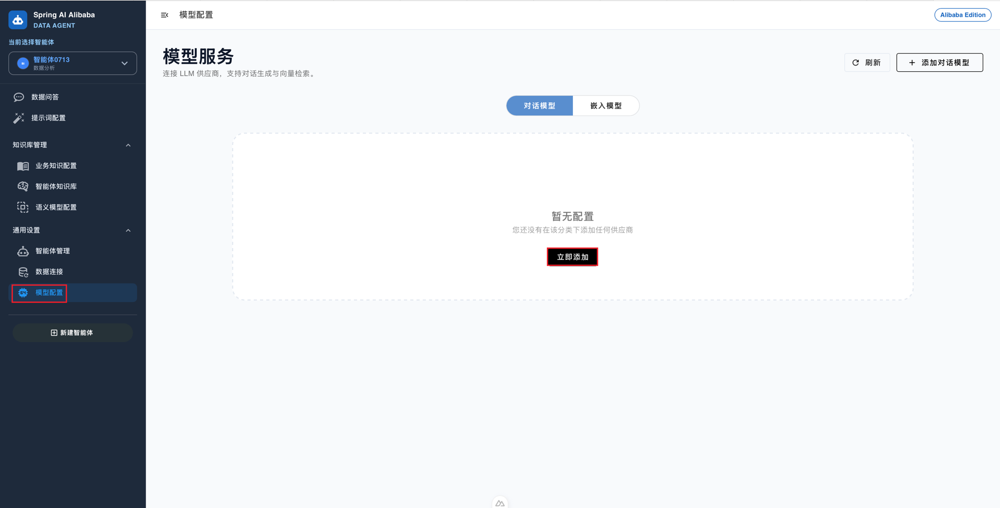

我填的值如下：

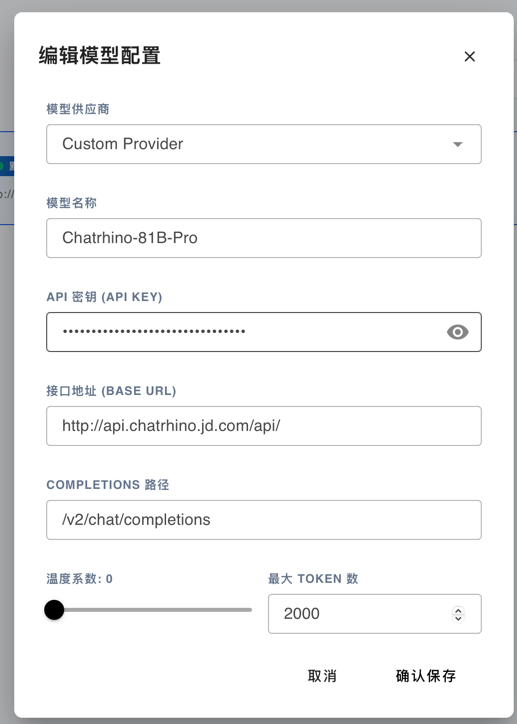

然后测试连接，成功即可进入下一步。

我一开始配置的是deepseek的API，点击测试连接，失败。情况如下：

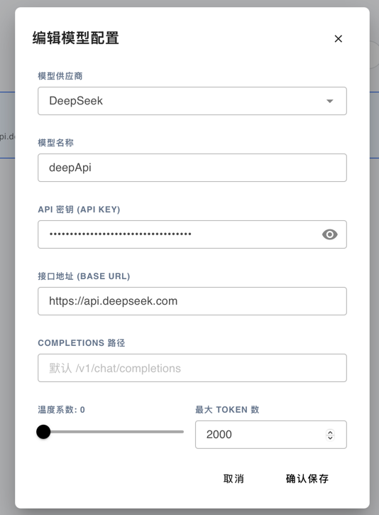

连接测试失败: 400 - {"error":{"message":"The supported API model names are deepseek-v4-pro or deepseek-v4-flash, but you passed deepApi.","type":"invalid_request_error","param":null,"code":"invalid_request_error"}}

修改API名称后，点击测试连接，成功。

#### 2.3.2 嵌入模型（向量模型）
点击"立即添加"或"添加向量模型"，填写模型配置。

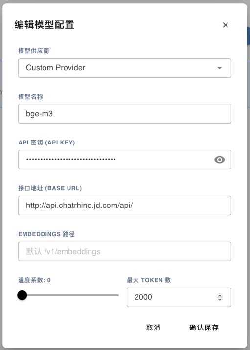

然后测试连接，成功即可进入下一步。

注意：

1. 标准提供商接入 如果您使用的是系统内置支持的 AI 提供商（如 OpenAI, Deepseek 等），通常只需要提供模型名称（Model Name）和 API Key。

2. 自定义及本地模型接入 (Ollama/自建网关) 本系统基于 Spring AI 架构，支持标准的 OpenAI 接口协议。如果您接入的是 Ollama 或其他自定义网关，请注意以下几点：

	- 协议兼容：请参考 Spring AI 官方文档中关于 OpenAI 兼容性的说明，确保您的网关响应格式符合标准。

	- 地址配置：针对自部署模型，请准确填写 base-url（基础地址）和 completions-path（请求路径）。系统会将两者拼接为完整的调用地址，例如：http://localhost:11434/v1/chat/completions

3. 故障排查 如发现配置后无法调用，建议优先使用 Postman 对接您的接口地址进行测试，确认网络连通性及参数格式无误。


### 2.4 嵌入模型批处理策略配置

配置前缀: `spring.ai.alibaba.data-agent.embedding-batch`

| 配置项 | 说明 | 默认值 |
|--------|------|--------|
| `encoding-type` | 文本编码类型 (参考 com.knuddels.jtokkit.api.EncodingType) | cl100k_base |
| `max-token-count` | 每批次最大令牌数。建议值：2000-8000 | 8000 |
| `reserve-percentage` | 预留百分比 (用于缓冲空间) | 0.2 |
| `max-text-count` | 每批次最大文本数量 (DashScope限制为10) | 10 |

### 2.5 向量库配置

系统默认使用内存向量库，同时系统提供了对es的混合检索支持。

#### 2.5.1 向量库依赖引入

您可以自行引入你想要的持久化向量库，只需要往ioc容器提供一个org.springframework.ai.vectorstore.VectorStore类型的bean即可。例如直接引入PGvector的starter

```xml
<dependency>
	<groupId>org.springframework.ai</groupId>
	<artifactId>spring-ai-starter-vector-store-pgvector</artifactId>
</dependency>
```

详细对应的向量库参考文档：https://springdoc.cn/spring-ai/api/vectordbs.html

#### 2.5.2 向量库schema设置

以下为es的schema结构，其他向量库如milvus，pg等自行可根据如下的es的结构建立自己的schema。尤其要注意metadata中的每个字段的数据类型。

```json
{
  "mappings": {
    "properties": {
      "content": {
        "type": "text",
        "fields": {
          "keyword": {
            "type": "keyword",
            "ignore_above": 256
          }
        }
      },
      "embedding": {
        "type": "dense_vector",
        "dims": 1024,
        "index": true,
        "similarity": "cosine",
        "index_options": {
          "type": "int8_hnsw",
          "m": 16,
          "ef_construction": 100
        }
      },
      "id": {
        "type": "text",
        "fields": {
          "keyword": {
            "type": "keyword",
            "ignore_above": 256
          }
        }
      },
      "metadata": {
        "properties": {
          "agentId": {
            "type": "text",
            "fields": {
              "keyword": {
                "type": "keyword",
                "ignore_above": 256
              }
            }
          },
          "agentKnowledgeId": {
            "type": "long"
          },
          "businessTermId": {
            "type": "long"
          },
          "concreteAgentKnowledgeType": {
            "type": "text",
            "fields": {
              "keyword": {
                "type": "keyword",
                "ignore_above": 256
              }
            }
          },
          "vectorType": {
            "type": "text",
            "fields": {
              "keyword": {
                "type": "keyword",
                "ignore_above": 256
              }
            }
          }
        }
      }
    }
  }
}
```

#### 2.5.3 向量库配置参数

配置前缀: `spring.ai.alibaba.data-agent.vector-store`

| 配置项 | 说明 | 默认值 |
|--------|------|--------|
| `default-similarity-threshold` | 全局默认相似度阈值 | 0.4 |
| `table-similarity-threshold` | 召回表的相似度阈值 | 0.2 |
| `batch-del-topk-limit` | 批量删除时的最大文档数量 | 5000 |
| `default-topk-limit` | 全局默认查询返回的最大文档数量（目前只有业务知识和智能体知识在使用） | 8 |
| `table-topk-limit` | 召回表的最大文档数量 | 10 |
| `enable-hybrid-search` | 是否启用混合搜索 | false |
| `elasticsearch-min-score` | ES关键词搜索的最小分数阈值 | 0.5 |

#### 向量库依赖扩展

项目默认使用内存向量库 (`SimpleVectorStore`)。若需使用持久化向量库（如 PGVector, Milvus 等），请按照以下步骤操作：

1. **引入依赖**: 在 `pom.xml` 中添加相应的 Spring AI Starter。

   ```xml
   <!-- 例如：引入 PGvector -->
   <dependency>
       <groupId>org.springframework.ai</groupId>
       <artifactId>spring-ai-starter-vector-store-pgvector</artifactId>
   </dependency>
   ```

2. **配置属性**: 在 `application.yml` 中添加对应向量库的连接配置。具体参数请参考 [Spring AI 官方文档](https://springdoc.cn/spring-ai/api/vectordbs.html)。

3. **配置 `spring.ai.vectorstore.type`**。具体填写的值可以在引入上面的向量库starter后自行搜索 `VectorStoreAutoConfiguration`自动配置类，比如`es`的是`ElasticsearchVectorStoreAutoConfiguration`，该类里面可以看见`spring.ai.vectorstore.type`期望的是`elasticsearch`。

## 🚀 3. 启动管理端

在`data-agent-management`目录下，运行命令：

```bash
cd data-agent-management
../mvnw spring-boot:run
```
或者在IDE中直接运行 `DataAgentApplication.java`。

mvnw 文件在项目根目录 /Users/yuye.27/IdeaProjects/DataAgent

## 🌐 4. 启动WEB页面

进入 `data-agent-frontend` 目录

### 4.1 安装依赖

```bash
# 使用 npm
npm install

# 或使用 yarn
yarn install
```

### 4.2 启动服务

```bash
# 使用 npm
npm run dev

# 或使用 yarn
yarn dev
```

启动成功后，访问地址 http://localhost:3000

## 🎯 5. 系统体验

### 5.1 数据智能体的创建与配置

访问 http://localhost:3000 ，跳转新建智能体页面，输入智能体名称，分类和标签，其他配置都选默认。点击右上角的创建智能体按钮。
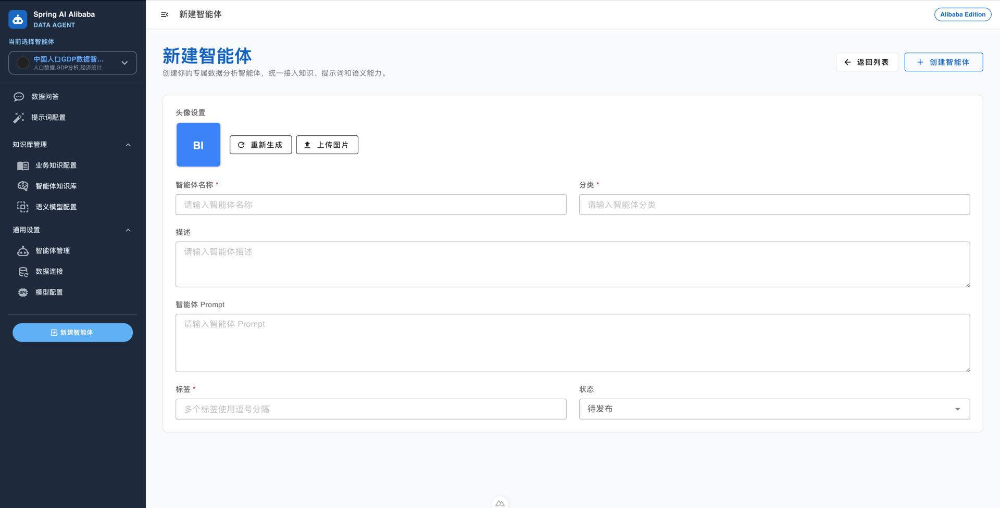

创建成功后，会跳转到对话页面。
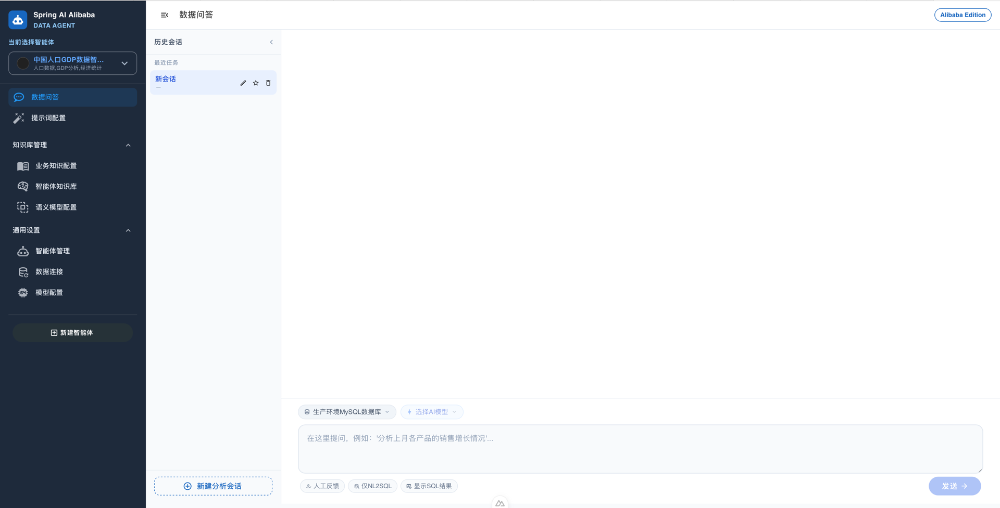

访问智能体管理页面[http://localhost:3000/system/agents](http://localhost:3000/system/agents)，可以看到当前项目的智能体列表（默认有四个占位智能体，并没有对接数据，可以删除掉然后创建新的智能体）
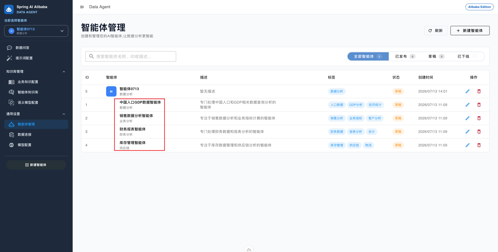

#### 配置数据源
进入数据连接页面，点击右上角的"添加数据源"按钮。 配置业务数据库（在环境初始化时第一步提供的业务数据库）。
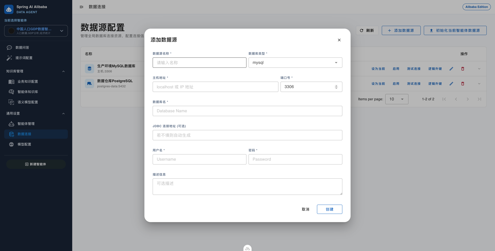
我配置的信息
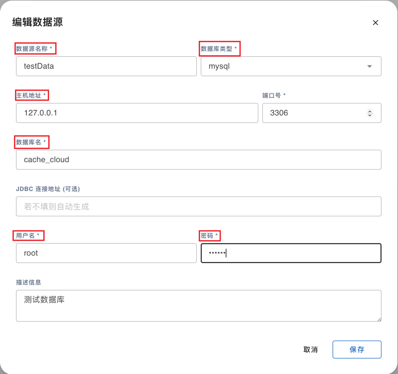

添加完成后，可以在列表页面验证数据源连接是否正常。然后点击"设为当前"按钮。
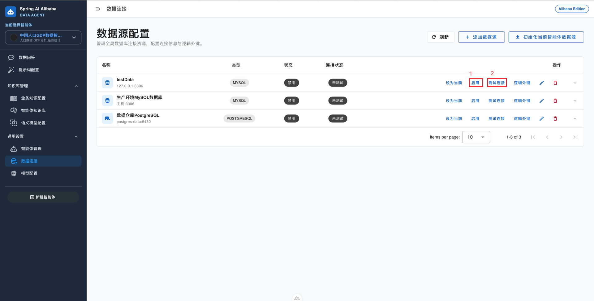
设置完成后显示如下：
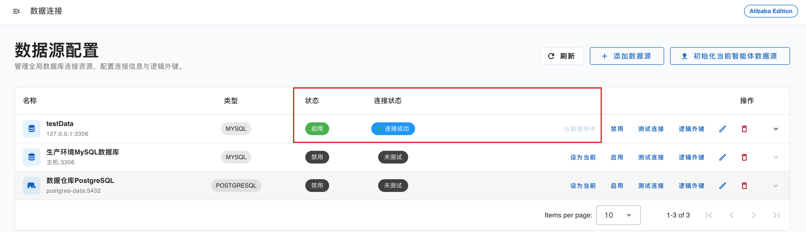
对于添加的新数据源，需要选择使用哪些数据表进行数据分析。
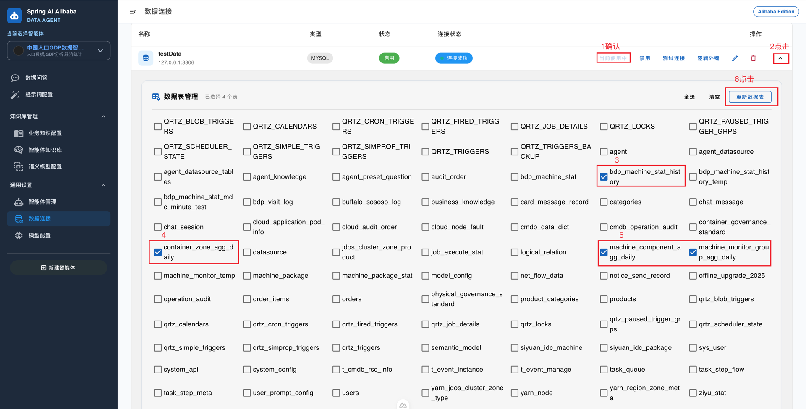
之后点击右上角的"初始化当前智能体数据源"按钮。

我遇到的问题：[POST] "/api/agent/1/datasources/init": 500 Internal Server Error，原因是我一开始只配置了对话模型，没有配置嵌入模型。
在配置嵌入模型后这个问题就解决了。

#### 配置语义模型

语义模型配置，可以为智能体设置语义模型。
语义模型库定义业务术语到数据库物理结构的精确转换规则，存储的是字段名的映射关系。
例如`customerSatisfactionScore`对应数据库中的`csat_score`字段。
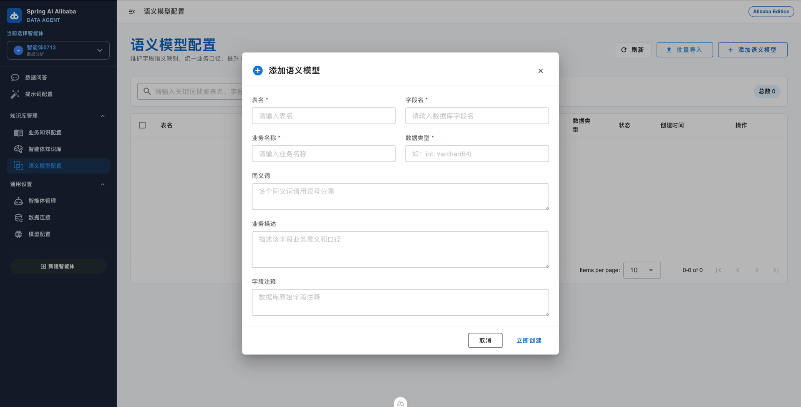

#### 配置业务知识

业务知识管理，可以为智能体设置业务知识。
业务知识定义了业务术语和业务规则，比如GMV= 商品交易总额,包含付款和未付款的订单金额。
业务知识可以设置为召回或者不召回，配置完成后需要点击右上角的"同步到向量库"按钮，否则 PENDING 状态不会被召回。
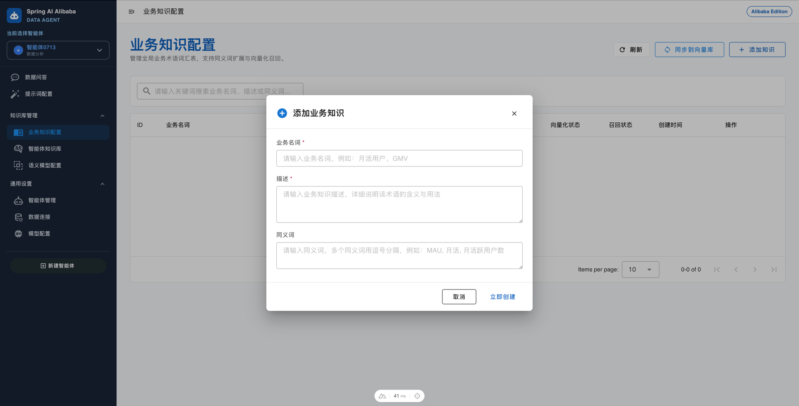

#### 配置智能体知识库
维护智能体专属知识资源，支持文档上传、问答配置与向量召回。
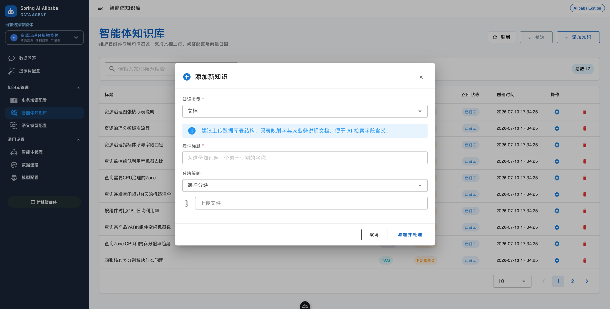

#### 提示词配置
维护增强式提示词配置，支持多配置启用、批量操作与优先级管理。
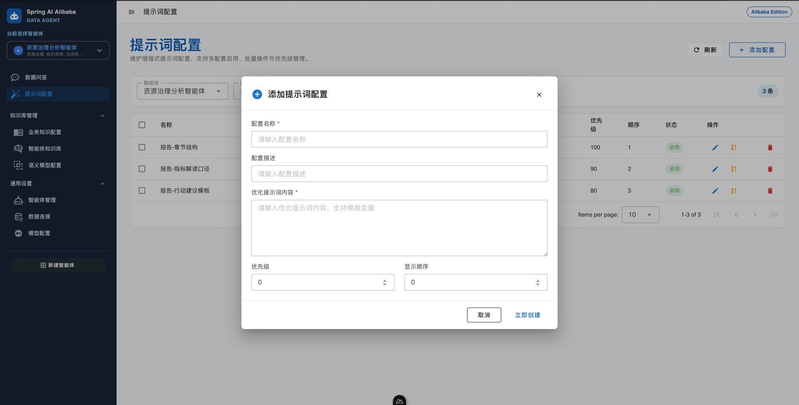

成功后可以点击"数据问题"使用智能体进行数据查询。 调试没问题后，可以发布智能体。

> 目前"访问API"在当前版本并没有实现完全，预留着二次开发用的

### 5.2 数据智能体的运行

运行界面
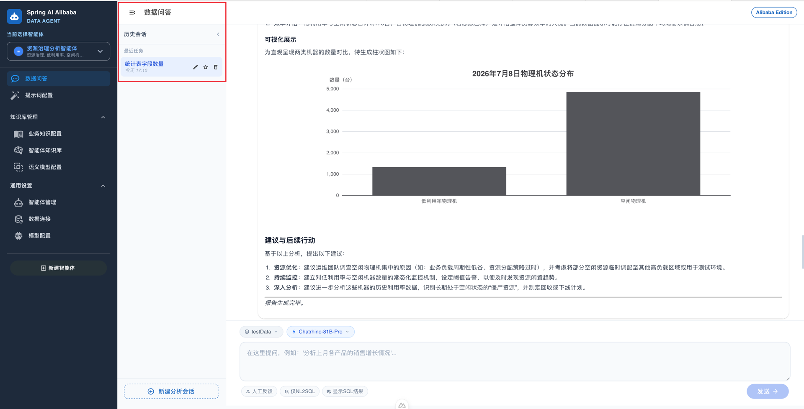
运行界面左侧是历史消息记录，右侧是当前会话记录、输入框以及请求参数配置。

输入框中输入问题，点击"发送"按钮，即可开始查询。

分析报告为HTML格式报告，点击"下载报告"按钮，即可下载最终报告。
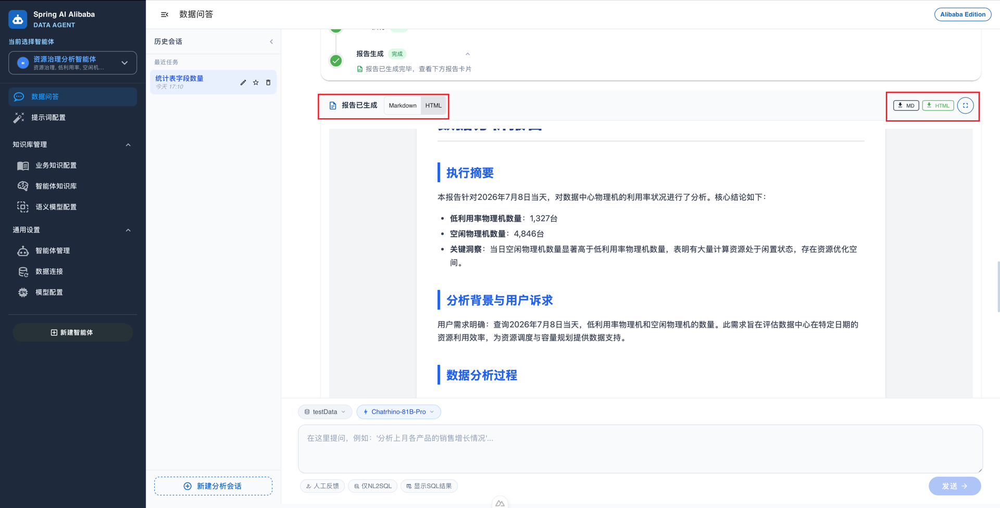

#### 运行模式

除了默认的请求模式，智能体运行时还支持"人工反馈"，"仅NL2SQL"和"显示SQL结果"等模式。

**默认模式**

默认情况不开启人工反馈模式，智能体直接自动生成计划并执行，并对SQL执行结果进行解析，生成报告。

**人工反馈模式**

如果开启人工反馈模式，则智能体会在生成计划后，等待用户确认，然后根据用户选择的反馈结果，更改计划或者执行计划。
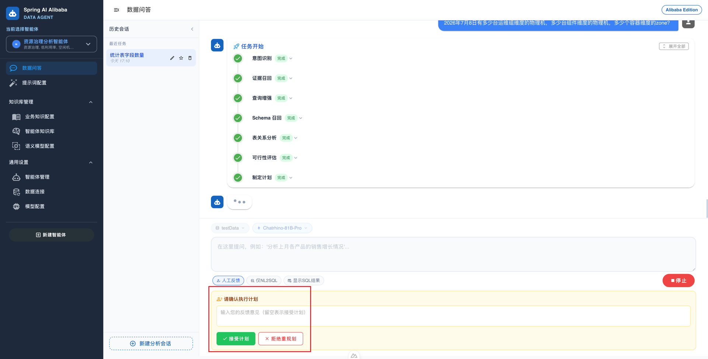

**仅NL2SQL模式**

"仅NL2SQL"模式会让智能体只生成SQL和运行获取结果，不会生成报告。

后端打印正常，前端显示有问题，并没有正常显示生成的SQL语句和SQL结果。


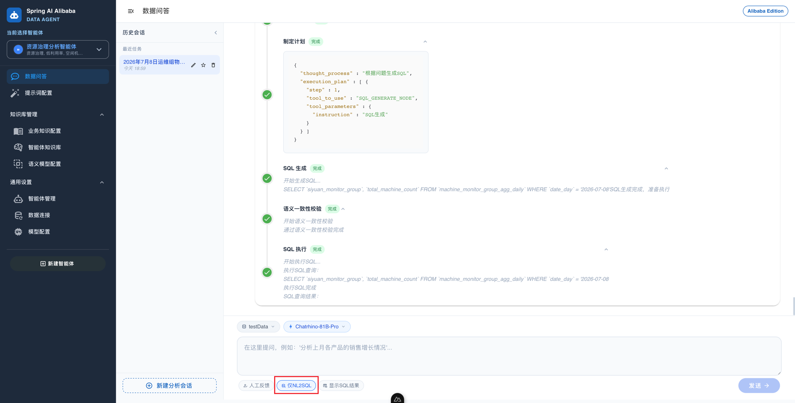
**显示SQL运行结果**

"显示SQL结果"会在生成SQL和运行获取结果后，将SQL运行结果展示给用户。
显示SQL结果模式下，现在的报告是有问题的。


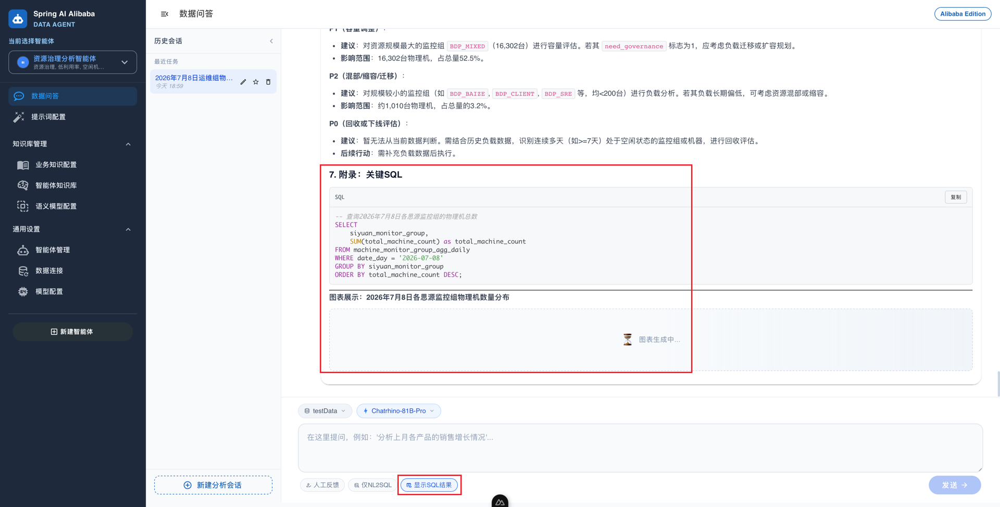


### 报错
1.No module named 'pandas'
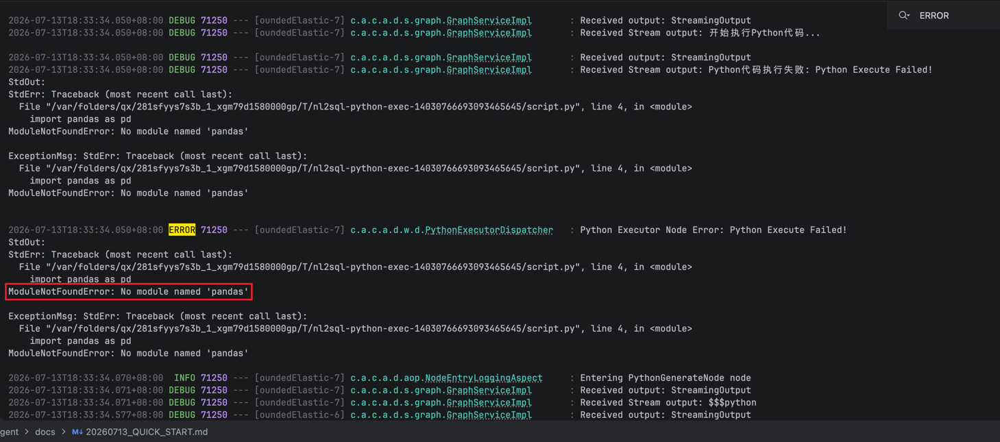